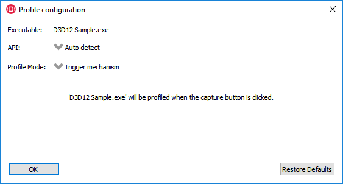
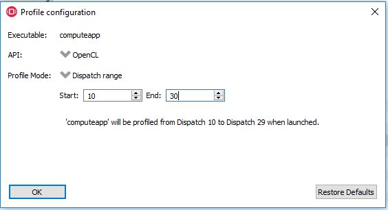
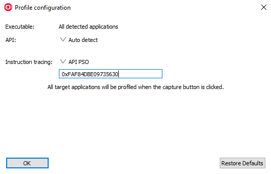

Profiling modes
---------------

  In addition to clicking on the **Capture profile** button or by using the
  capture profile hotkey, a **Dispatch range** can be specified for OpenCL
  applications. To configure the panel to capture an OpenCL Dispatch range,
  go back to the **Connection** tab and click on the **Edit** button
  next to the Enable profiling checkbox. With Advanced mode turned off, there
  will be one **Edit** button next to the Enable profiling checkbox. If
  Advanced mode is active, each row will have an **Edit** button next to each
  Profiling enable checkbox. Click the **Edit** button for the row which has a
  filter matching the target application to be profiled. A dialog box will
  then open:

The API combobox is used to select which profiling option(s) are displayed
for a supported API. The **Auto detect** API selection acts as a catch-all
if the API isn't chosen, and only supports the **Trigger mechanism**.

Selecting **OpenCL** for the *API* and choosing **Dispatch range** for the
*Profile mode* will display start and end dispatch edit boxes. For example,
the values 5 and 20 could be entered and the profile would consist of 15
dispatches starting with the 5th dispatch. The 20th dispatch is not included
in the trace.

The number of dispatches captured is limited to 50 at present to prevent the
amount of captured data becoming too large.

Below the profile mode is an option to allow detailed instruction tracing.
Normally this is disabled but a hexadecimal API PSO hash value may be specified.
During capture, any event with the same API PSO hash will have its instruction
timings recorded and these can be viewed in the Instruction Timing tab in the
Radeon GPU Profiler. Refer to the documentation with the Radeon GPU Profiler to
understand the capture granularity and limitations of instruction tracing. API
PSO hash values should be non-zero and less than UINT64_MAX, otherwise
instruction tracing will be disabled.

The normal workflow would follow this pattern:

- A profile would be taken in the traditional way without the API PSO hash
  specified.

- The profile can be loaded into the Radeon GPU Profiler and inspected to find
  an event of interest.

- The API PSO hash value can be copied to the clipboard from the UI.

- The API PSO hash value can then be pasted into the edit box in the Radeon
  Developer Panel and the application can then be restarted and profiled in
  the same way as before. Obviously, it is important that the scene in the
  application is similar when taking both captures so that the same API PSO is
  being executed on the GPU.

Once the profile configuration settings have been entered for the target
application, click the **OK** button to close the dialog. Start the target
application in the normal way.

**Notes:**

- Currently for Vulkan, the API PSO needs to be specified before the
  application is started. For DX12 it is possible to take a profile, change the
  PSO value and take another profile in the same session.

- It is important that the API PSO hash be identical between the 2 profiles.
  For example, modifying shader code could change the API PSO hash.

- The **Restore Defaults** will restore the defaults for the API selected in
  the API combobox for the current target application.

  If **Dispatch range** has been specified, the profile will be carried out
  automatically according to the parameters specified. Therefore, on the
  **Profiler** tab, the **Capture profile** button will be grayed out. Once
  the profile has been taken, it will be added to the **Recently collected
  profiles** list.

  RDP will detect the API type of a running target application and automatically
  apply the appropriate profile options.  If for example, an **OpenCL** application
  is started, the profile options entered in the Profile configuration dialog box
  for the **OpenCL** API will be applied. If a graphics application is started,
  the **Trigger mechanism** profile mode will be applied.

**Note:** Only recent drivers support these new profile modes. If the driver
doesn't support a particular profile mode, a warning message will be displayed
and profiling for that run of the application will be disabled. The default
**Trigger mechanism** profile mode should always work.
