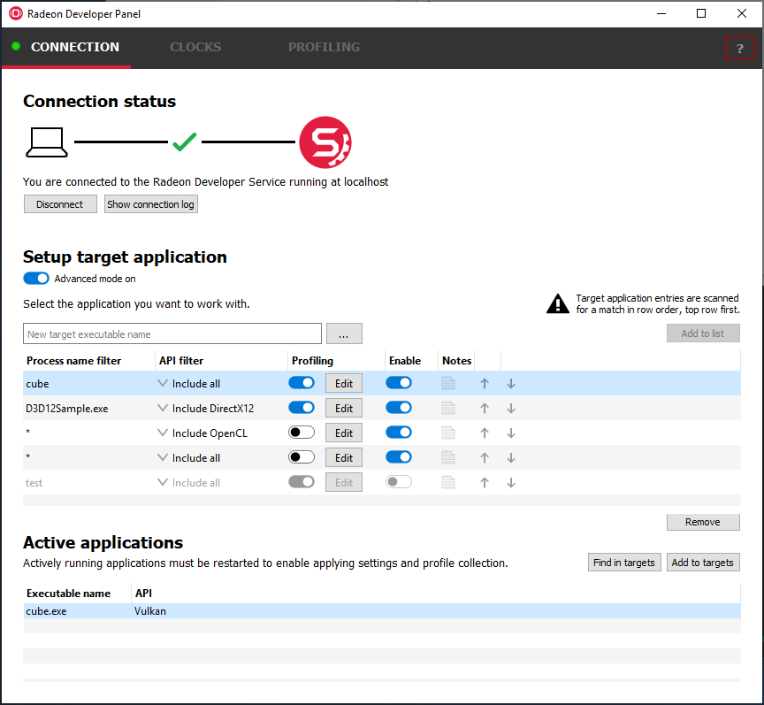
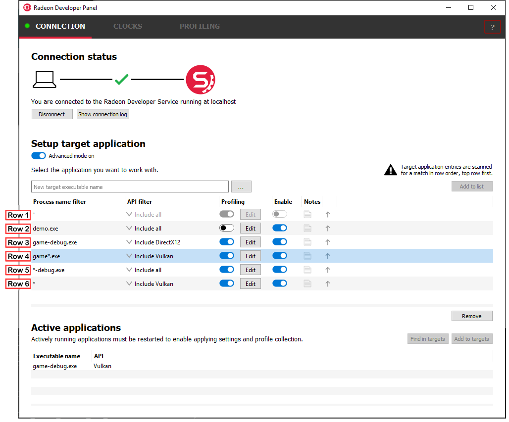
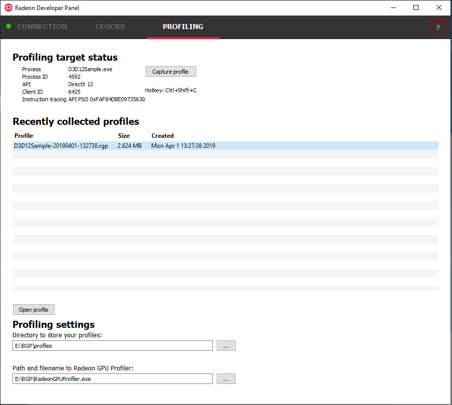

The Radeon Developer Panel
==========================

The Radeon Developer panel is part of a suite of tools that can be used
by developers to optimize DirectX12 and Vulkan applications for AMD GCN
graphics hardware. The suite is comprised of the following software:

-  **Radeon Developer Mode Driver** – This is shipped as part of the AMD
   public driver and supports the developer mode features
   required for profiling and debugging.

-  **Radeon Developer Service (RDS)** – A system tray application that
   unlocks the Developer Mode Driver features and supports
   communications with high level tools.

-  **Radeon Developer Service - CLI (Headless RDS)** – A console (i.e.
   non-GUI) application that unlocks the Developer Mode Driver features
   and supports communication with high level tools.

-  **Radeon Developer Panel (RDP)** – A GUI application that allows the
   developer to configure driver settings and generate profiles from
   DirectX12, Vulkan and OpenCL applications.

-  **Radeon GPU Profiler (RGP)** – A GUI tool used to visualize and
   analyze the profile data.

   This document describes how the Radeon Developer Panel can be used to
   profile frame-based applications on AMD GCN graphics hardware. The
   Radeon Developer Panel connects to the Radeon Developer Service in
   order to collect a profile.

   **Note:** By default, the driver allocates a maximum of 128 MB video
   memory per Shader Engine to capture RGP profiles.

Getting started on Windows
==========================
-  To collect complete profiles for DirectX 12, run the script 'AddUserToGroup.bat'
   in the scripts folder. See :ref:`DX12-timing-ref` for more information
-  You may want to blacklist certain applications so they don't show up in the
   UI. For details, see :ref:`Blacklisting-ref`

Getting started on Linux
========================

-  After installing the latest video driver, make sure that the current user
   is a member of the graphics group. This can be done by typing:
   “\ **sudo usermod -a -G video $LOGNAME**\ ”
   Where $LOGNAME is the user name. Log out and log back in again for this to
   take effect.

-  Install the vulkan shared library by typing “\ **sudo apt-get install libvulkan1**\ ”
   or by downloading the Vulkan SDK from the `LunarG website <https://www.lunarg.com/>`_.

-  Run the **scripts/EnableSetClockMode.sh** script to enable setting the GPU clock. See
   :ref:`Linux-GPU_clocks-ref` for more information

-  If you wish to capture profiles using the keyboard hotkey, see :ref:`Linux-keyboard-ref`

How to profile your application
===============================

Profiling on a local system
---------------------------

**IMPORTANT:** The application you want to profile must NOT already be
running. The panel needs to be configured in advance of starting your
application.

1) **Start the RadeonDeveloperPanel.exe** on your local system. The
   panel will startup up with the Connection tab already highlighted
   (see below).

.. image:: media/Connection_1.png
..

   The UI has three main elements:

-  **Connection status** – to the Radeon Developer Service (currently
   not connected)

-  **Recent connections** – list shows a history of your previous
   connections

-  **New connection** – section that allows you to make either a new
   local or remote connection

1) **Connect the Radeon Developer Panel to the Radeon Developer
   Service** using either of the following methods:

   a. **Select the localhost entry in the “Recent connections” list,
      then click the “Connect” button.** This will start the Radeon
      Developer Service on the local system and establish a connection.

   b. **Double-click on any Recent connection**, and RDP will attempt to
      establish a connection to RDS running on the given host.

Note that the red dot to left of the “CONNECTION” tab should change to
green to indicate that the connection was successful.

    You may get a **“Failed to connect to RDS”** pop up message when
    running the panel for the very first time. If the Radeon Developer
    Service is not running, the panel will try to start the service
    automatically for local connections and this can fail due to Windows
    file permissions (the Radeon Developer Service will not be a known
    application to Windows and the program will not be permitted to
    start). If you see this message try manually starting the
    “RadeonDeveloperService.exe” and connect again.

Target application configuration
--------------------------------

  Once a connection to RDS has been established, the Connection options
  are replaced with the Setup target application view.  This view allows
  target applications to be configured for profiling and other diagnostic
  operations.  RDP provides two modes for configuring target applications:

- **Global mode (basic)** – RDP detects and configures every graphics or
  compute based application that is launched.  This is the default mode when
  RDP is started.

- **Advanced mode** - Specific configurations can be applied to individual
  target applications or groups of target applications when they are launched.

  Clicking the UI toggle switch below the **Setup target application** heading
  selects **Global** or **Advanced mode**.

  Shown below is the user interface for the Global mode:

  .. image:: media/Target_apps_1.png

  Before starting your application, make adjustments to the target application
  configuration settings.  The Enable profiling setting is enabled by default.
  Apply settings is disabled by default.  In this mode, RDP will detect any target
  application when it is launched and switch to the Profiling tab if profiling
  is enabled.

Advanced Target application configuration
-----------------------------------------

Users requiring more control over how target applications are configured can
switch to the Advanced mode.  In this mode, the user can apply configurations
for individual applications, groups of applications or a specific API used by
an application (DirectX, Vulkan or OpenCL).

Below is the Target application configuration Advanced mode:

The following methods can be used to add entries to the target application
configuration table:

a. Use the “…” button to browse to the executable, or manually type
it in the executable name textbox.

b. Use the executable name textbox to enter an asterisk '*' which is used
as a catch-all for any target application launched.

c. Select an active process within the Active Applications table, and
click the “Add to targets” button. The process will need to be
restarted in order to apply settings at application startup, and
to enable collection of RGP profiles.

Each row in the Target application configuration table contains configuration
options applied to a target application or multiple applications.  The row
selected by RDP when a target application is launched is determined by the
row's preference (the top row is the highest preference) and three columns
in the table:

1) **Process name filter column** - This is a filespec that must match the target
application's process name.  Partial filenames, asterisks and exact
matching names are all considered while matching. For example, the following Process
name filter strings will match a target application named "sample-release.exe"

- ``*``
- ``*.exe``
- ``sample*.exe``
- ``*-release``
- ``sample-release.exe``

On Linux, the matching is case sensitive.  On Windows case is ignored.

2) **API filter column** - RDP detects the API of driver clients initiated
when a target application is launched.  The row in the target application
configuration table is skipped if the API type of the application doesn't
match the API filter.  Four modes of API filtering are provided: Include
DirectX12, Include Vulkan, Include OpenCL or Include all (the default).
Setting an API filter can be useful when an application contains more than
one client with different API types.  RDP can be configured to filter out
those clients with APIs which aren’t of interest.  When used in conjunction
with an asterisk for process name filters, multiple rows can each have
different API filter (one row handling all DirectX applications and one row
handling all Vulkan applications, for example).

3) **Enable column** - An entire row can be disabled if it isn't currently
needed, but may be needed in the future.  The row will be excluded when RDP
attempts to find a match for a target application that is launched.  When a
row is disabled, the text is shaded light gray.  Click the toggle switches in
the row's Enable columns to enable or disable that entry.

In Advanced mode, having rows with duplicate filter options is supported (i.e.
the same Process filter name and same API filter selection). Multiple rows can
also have profiling enabled. This allows the user to have multiple sets of
configurations in the table for a target application or group of target
applications that can be easily enabled or disabled. Raising or lowering the
row in the list can also be used to control which one is chosen.  When a
target application is launched, RDP scans the list from top to bottom until
an enabled row matching the process name filter (exact, partial or asterisk)
and API filter is found. The screenshot below illustrates which row will be
used for configuration if, for example, a Vulkan application called
game-debug.exe is launched:

- Row 1 is not matched because it is disabled

- Row 2 is not matched because the process name is different

- Row 3 is not matched because the API is different

- Row 4 matches partial process name with asterisk wildcard,
  API type and the row is enabled

- Rows 5 and 6 match, but are lower in the list than the first match

When advanced mode is enabled, the **Find in targets** button can be used
to identify which row in the target application configuration table will be
used by RDP when an application is launched. Select a previously run
application from the Active application table then click the **Find in targets**
button. The row in the Target application configuration table that RDP will use
when the application is launched again will be selected. If no match is found,
all rows will be deselected.

The row used is also automatically selected when the target application is
launched.

The order of rows in the Target application configuration table can be
adjusted using the up and down arrow icons in the columns to the right.
Clicking the up or down arrow moves the row up or down by one row.  Holding
the control key while clicking the up or down arrow moves the row to the top
or bottom of the list. Alternatively, right clicking on a row will displays
a context menu with options to reorder rows.

Clicking on the notes icon opens a notepad dialog box allowing the user to
enter a brief description of the configuration details for the row.  Hovering
over the notes icon with the mouse will display a tooltip with the description
entered.

**Start your application.**

The driver will render an overlay on top of the application’s render
window if all is working correctly. The overlay will indicate if
Profiling is enabled for the application, and will display the Client
Id that RDP uses to communicate with the process.

.. image:: media/Application_1.png

The panel will detect when your application has started, and will switch
to the Profiling tab.

.. image:: media/Profiling_1.png

1) **Click the “Capture profile” button** or press the **Ctrl + Shift +
   C** hotkey to generate an RGP profile. The hotkey can be useful when
   capturing profiles from applications running full screen or when an
   app requires focus when rendering. After a few seconds a new profile
   should appear in the list below.

   **Note:** Certain anti-virus software may block the hotkey feature
   from monitoring key presses.

1) Right-clicking on a row in the list of recent profiles will open a
   context menu for the selected file. The context menu allows you to
   quickly navigate to the profile location in the filesystem, and
   rename or delete the file.

.. image:: media/Profiling_3.png

2) To open a profile file in the Radeon GPU Profiler, select the profile
   in the list and **click the “Open profile” button** or **double-click
   the selected row**.

.. include:: ProfilingModes.rst

.. _Linux-keyboard-ref:

Capturing using the keyboard on Linux
-------------------------------------
Some applications capture focus or run fullscreen which makes capturing
a profile difficult. The RadeonDeveloperPanel provides a hotkey to allow
capturing using the keyboard. Presently, this is Shift-Ctrl-C. On Linux,
the hotkey is only available when starting the Panel with elevated privileges
(ie sudo RadeoDeveloperPanel). Root privileges are needed in order to read
the keyboard device, which by default is found in the path ‘/dev/input/by-path’,
and is a file ending with ‘event-kbd’. If this path doesn’t exist or the
keyboard device has a different name, copy the KeyboardDevice.txt file from
the docs directory to the root folder where these tools are located and edit
this file so it contains the full path and file name of the keyboard device
on your system.

Profiling on a remote system
----------------------------

There are two variations of the Radeon Developer Service: The GUI based
RadeonDeveloperService and the RadeonDeveloperServiceCLI (command line
interface). For headless operating systems which do not support a
graphical user interface, the RadeonDeveloperServiceCLI executable can
be started from a terminal console window.

The following steps are used to connect the RadeoDeveloperPanel to a
remote Radeon Developer Service:

1) **Start the RadeonDeveloperService or RadeonDeveloperServiceCLI
   executable** on the **remote** system.

   a. **NOTE: RadeonDeveloperServiceCLI** is a command line version of
      the Radeon Developer Service that has no UI components and is
      designed to run from the command line. Please note that no system
      tray icon will appear when the command line version of the service
      is running.

2) **Start the RadeonDeveloperPanel executable** on your **local**
   system. The panel will start up with the Connection tab already
   highlighted (see below).

3) In the **New connection** section, fill in the **Address** text box
   with the IP address of the remote system running the Radeon Developer
   Service.

4) **Click the “Connect new” button**. This will establish a connection
   to the remote system. The red dot to left of the “CONNECTION” tab
   should change to green to indicate that the connection was
   successful.

.. image:: media/Connection_3.png

5) **Go to step 3** in **“**\ Profiling on a local system” above and
   continue.

.. _Blacklisting-ref:

Blacklisting applications
=========================

Sometimes it is useful to completely exclude certain background applications
from being recognized and displayed in the Radeon Developer Panel. For example,
Windows 10 has applications that use DirectX 12 and when they are started can
show up in the list of target applications. When first running the panel, a
default list of blacklisted applications is generated and written to
**ProcessBlacklist.txt** in the folder:
**C:\\Users\\<user_name>\\AppData\\Roaming\\RadeonDeveloperDriver**. This file can be
updated to include other applications that are to be ignored. If the file is
removed or isn't present, a file containing a default list of blacklisted
applications will be added. A current list of blacklisted applications can be
found from the open source DevDriverTools on github
(https://github.com/GPUOpen-Tools/DevDriverTools) near the top of the file:
source\RDP\Settings\RDPSettings.cpp

Using the Clock settings
========================

The Radeon developer Panel (RDP) allows the developer to select from a
number of clock modes.

.. image:: media/Clocks_1.png

Normal clock mode will run the GPU as it would normally run your
application. To ensure that the GPU runs within its designed power and
temperature envelopes, it dynamically adjusts the internal clock frequency.
This means that profiles taken of the same application may differ
significantly, making side-by-side comparisons impossible.

Stable clock mode will run the GPU at a lower, fixed clock rate. Even though
the application may run slower than normal, it will be much easier to compare
profiles of the same application.

For the Radeon GPU Profiler tool, the clock settings here are not used since the
driver forces a profile to take place using peak clocks.

The Connection log
==================

Click on the "Show connection log" button from the CONNECTION tab to see any
logging information that is produced by the the panel activity. Additional
information about the connection and any errors encountered by RDP and the RDS are
displayed here. Below is an example of typical output from a session that captured
a profile. The log can be saved, cleared and copied to the clipboard using the
buttons at the bottom.

| This log is also saved in a log file located at:
| "C:\\Users\\your\_name\\AppData\\Roaming\\RadeonDeveloperDriver\\RDPLogFile.txt"

| On Linux, this log is located at:
| "~/.RadeonDeveloperDriver/RDPLogFile.txt"

.. image:: media/Log_1.png

The Radeon Developer Service
============================

Two version of the Radeon developer service are provided, one with a
configuration UI and system tray icon, and one designed for use with
headless GPU system where no UI can be supported.

Radeon Developer Service for desktop developer system
-----------------------------------------------------

RadeonDeveloperService(.exe) – Can be used for general use where the
system has a monitor and UI (e.g. desktop development machines). The
Radeon Developer Service includes a configuration window containing
basic service configuration settings and software info. **Double click
the Radeon Developer Service system tray icon** to open the
configuration window, or right-click on the system tray icon and select
‘configure’ from the context menu.

.. image:: media/RDS_1.png

-  **Listen port** – The port that the Radeon Developer Service uses to
   listen for incoming connections from a remote Radeon Developer Panel.
   **The default port is 27300**. Altering the port will disconnect all
   existing sessions. The circular arrows icon to the right of the
   Listen port field can be clicked to reset the port to the default
   value.

-  **Version info** – Software version information for the Radeon
   Developer Service.

Double click the Radeon Developer Service system tray icon again or
right-click on the system tray icon and select ‘configure’ from the
context menu to close the configuration window.

**Please note** that when running both the Radeon Developer Panel and
the Radeon Developer Service on the same system the communication
between the two uses pipes, not sockets and ports, so setting the port
has no effect.

Radeon Developer Service for headless GPU systems
-------------------------------------------------

RadeonDeveloperServiceCLI(.exe) – Command line version for use with
headless GPU systems where no UI can be provided. NOTE: This version can
also run on a system that has a monitor and UI.

The following command line options are available for
RadeonDeveloperServiceCLI:

1) **-- port <port number>** *Overrides the default listener port used
   by the service (27300 is the default).*

**Please note** that the service will need to be explicitly started
before starting the Radeon Developer Panel. If the service isn’t
running, the Radeon Developer Panel will automatically start the UI
version of the Radeon Developer Service, which may not be what is
required.

Known Issues
============

Cleanup After a RadeonDeveloperServiceCLI Crash
-----------------------------------------------

If the RadeonDeveloperServiceCLI executable crashes on Linux, shared
memory may need to be cleaned up by running the RemoveSharedMemory.sh
script located in the script folder of the RGP release kit. Run the
script with elevated privileges using sudo. If this fails to work,
try starting the panel with elevated privileges.

Windows Firewall Blocking Incoming Connections
----------------------------------------------

1) **Deleting the settings file**. If problems arise with connection or
   application histories, these can be resolved by deleting the Radeon
   Developer Panel’s settings file at:
   "C:\\Users\\your\_name\\AppData\\Roaming\\RadeonDeveloperDriver\\RDPSettings.xml"

   on Windows. On Linux, the corresponding file is located at:

   "~/.RadeonDeveloperDriver/RDPSettings.xml"

2) **“Connection Failure”** error message. This issue is sometimes seen
   when running the panel for the very first time. The panel tries to
   start the service automatically for local connections and this can
   fail. If you see this message try manually starting the
   “RadeonDeveloperService.exe” and connect again.

3) **Remote connection attempts timing out.** When running the Radeon
   Developer Service on Windows, the Windows Firewall may attempt to
   block incoming connection attempts from other machines. The best
   methods of ensuring that remote connections are established correctly
   are:

   a. Allow the RDS firewall exception to be created within the Windows
      Firewall when RDS is first started. Within the Windows Security
      Alert popup, enable the checkboxes that apply for your network
      configuration, and click “Allow access”.

.. image:: media/Firewall_1.png

a. If “Cancel” was previously clicked in the above step during the first
   run, the exception for RDS can still be enabled by allowing it within
   the Windows Control Panel firewall settings. Navigate to the “Allow
   an app or feature” section, and ensure that the checkbox next to the
   RadeonDeveloperService.exe entry is checked:

.. image:: media/Firewall_2.png

.. image:: media/Firewall_3.png

a. Alternatively, disable the Windows Firewall entirely will also allow
   RDS to be connected to.

   **NOTE** The Windows firewall alert in no way indicates that the Radeon
   Developer tools are trying to communicate to an AMD server over the
   internet. The Radeon Developer tools do not attempt to connect to a remote
   AMD server of any description and do not send personal or system information
   over remote connections. The Radeon Developer Panel needs to communicate
   with the Radeon Developer Service, which may or may not be on the same
   machine, and a connection needs to be made between the two (normally via a
   socket).

Disabling Linux Firewall
------------------------

If the remote machine is running Linux and the **“Connection Failure”**
error message is displayed, the Linux firewall may need to be disabled.
This is done by typing “\ **sudo ufw disable**\ ” in a terminal. The
firewall can be re-enabled after capturing by typing “\ **sudo ufw
enable**\ ”.

.. _Linux-GPU_clocks-ref:

Setting GPU clock modes on Linux
--------------------------------

Adjusting the GPU clock mode on Linux is accomplished by writing to
/sys/class/drm/card<n>/device/power\_dpm\_force\_performance\_level,
where <n> is the index of the card in question. By default this file is
only modifiable by root, so the application being profiled would have to
be run as root in order for it to modify the clock mode. It is possible
to modify the permissions for the file instead so that it can be written
by unprivileged users. The Radeon GPU Profiler package includes the
“\ **scripts/EnableSetClockMode.sh**\ ” script which will allow setting
GPU clock mode in cases where the target application is not, or cannot,
run as root. **Execute this script before running the Radeon Developer
Service and target application,** and the GPU clock mode can be updated
correctly at runtime. This script needs to be run each time you reboot
your machine; the file permissions do not survive system reboots.

Running the Panel with elevated privileges
------------------------------------------

As previously mentioned, the panel only needs to be run with elevated
privileges if the keyboard shortcut is needed for capturing. On Ubuntu 18.04,
a dialog box may pop up indicating that the RadeonDeveloperService is running
in headless mode. This is nothing to worry about and will not affect profiling
in any way; it just means that the root shell doesn't have access to the system
tray so is running without a user interface. The only downside is that there
won't be a 'service' icon available on the desktop.

Radeon Developer Panel connection issues on Linux
-------------------------------------------------

The Radeon Developer Panel may fail to start the Radeon Developer
Service when the Connect button is clicked. If this occurs, manually
start the Radeon Developer Service, select localhost from the the Recent
connections list and click the Connect button again.

.. _DX12-timing-ref:

Missing Timing Data for DirectX 12 Applications
-----------------------------------------------

To collect complete profile datasets for DirectX 12 applications, the
user account in Windows needs to be associated with the “Performance Log
Users” group. If these privileges aren't configured properly, profiles
collected under the user’s account may not include all timing data for
GPU Sync objects.

A batch file is provided to add the current user to the group
(scripts\\AddUserToGroup.bat). The batch file should be run as
administrator (Right click on file and select “Run as Administrator”).
The script’s output is shown below:

.. image:: media/Bat_1.png

Alternatively, to manually add the active user to the proper group,
follow these steps:

1) **Open the Run dialog** by using the Windows Start menu, or through
   the Windows + R shortcut.

   a. **Type** "**lusrmgr.msc**" into the Run window, and **click OK**.

.. image:: media/Run_1.png

2) Within the "Local Users and Groups" configuration window that opens,
   **select the Groups node**.

   a. **Select the Performance Log Users entry. Right-click and select
      Properties**.

.. image:: media/Users_1.png

1) To add the active user to the group, **click the Add... button**. (If
   the active user appears within this list, the account is already
   configured properly.)

.. image:: media/Add_User_1.png

2) **Type the active user's account name** into the Select Users,
   Computers, Service Accounts, or Groups dialog, and **click OK**.

.. image:: media/Select_User_1.png

3) When the user has been added to the group, **restart the machine**
   and log back in. RDS should now be configured to collect full timing
   information for DirectX 12 applications.

Radeon Developer Service Port numbers
-------------------------------------

Please note that when running both the Radeon Developer Panel and the
Radeon Developer Service on the same system the communication between
the two uses pipes, not sockets and ports, so setting the port has no
effect. In this scenario, it is possible to set the service to listen on
a no-default port, leave the panel on the default port, and connection
will work fine.

Problems caused by the presence of non-AMD GPUs and non-AMD CPUs with integrated graphics
-----------------------------------------------------------------------------------------

The presence of non-AMD GPU's and CPU's on your system can cause the failure to generate a profile
or apps to not run at all.

These problems typically occur with Vulkan apps in systems that have:

1) A non-AMD CPU with in integrated non-AMD GPU

2) A non-AMD discrete GPU

Vulkan applications, by default, use GPU 0 which usually maps to the integrated GPU, or in some cases,
the non-AMD discreete GPU. In both cases Vulkan apps will either fail to run, or RGP profiling will not work
(no RGP overlay will be present in these cases).

To avoid these issues:

1) Disable any non-AMD integrated GPU's in the device manager
2) Disable any non-AMD discrete GPU's in the device manager, and/or physically remove from the system.

