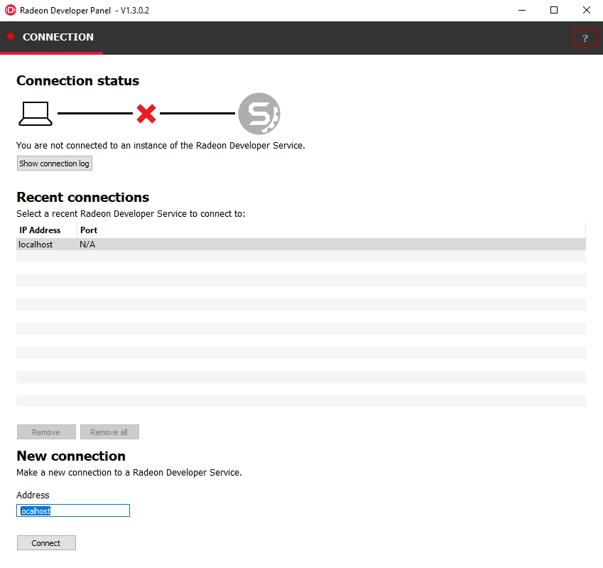
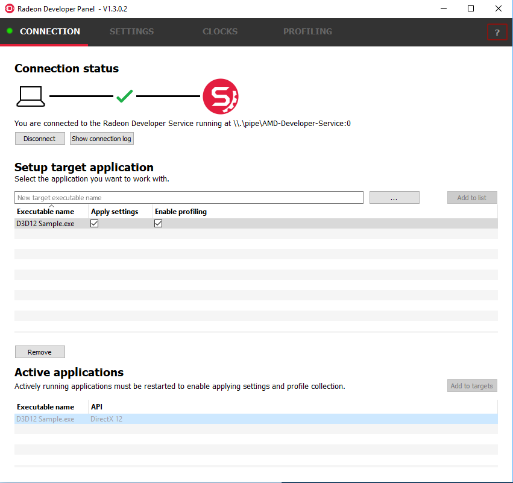
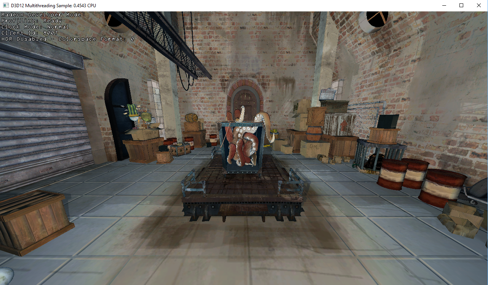
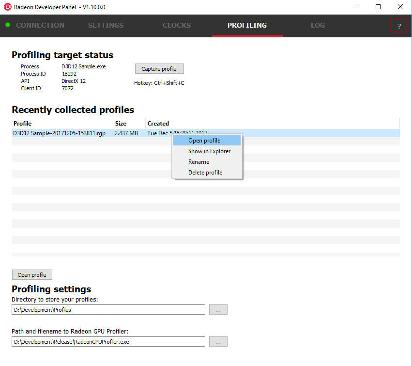
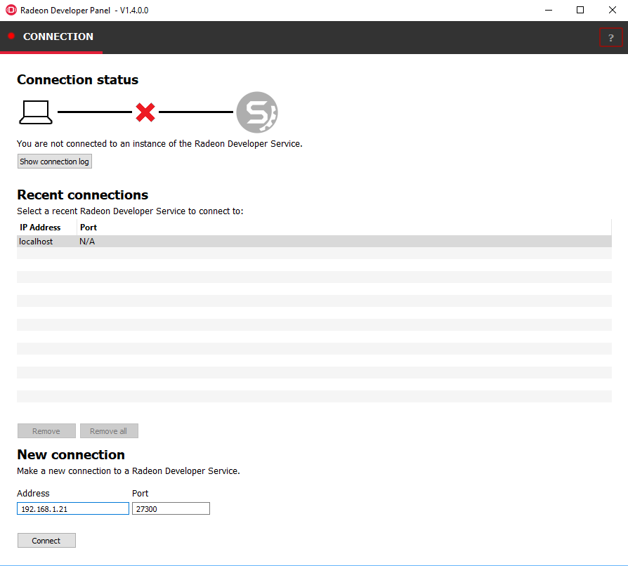
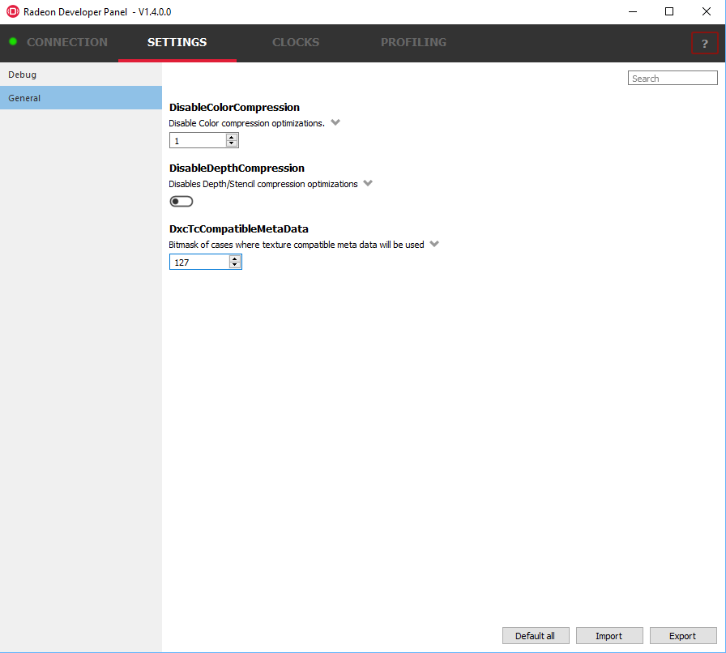
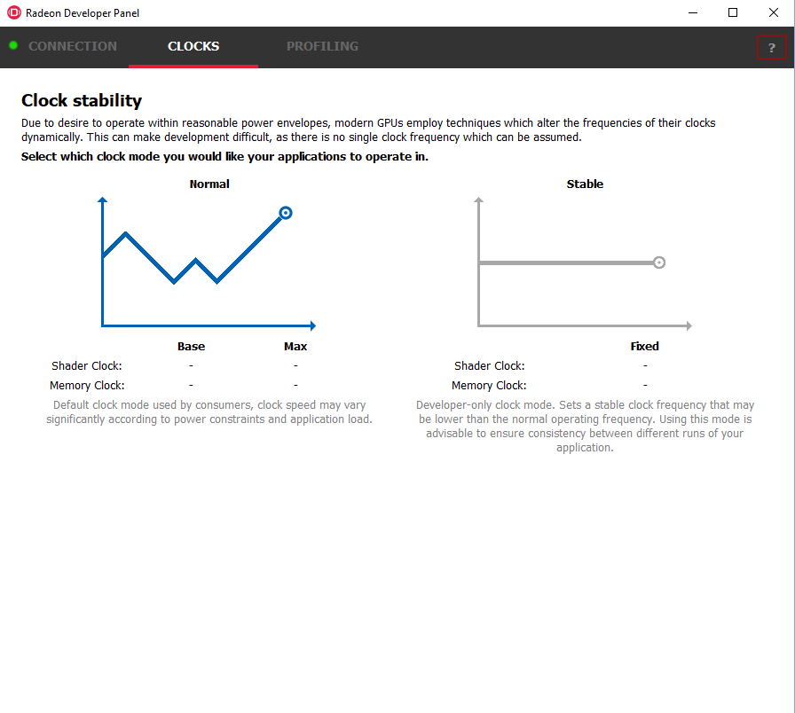
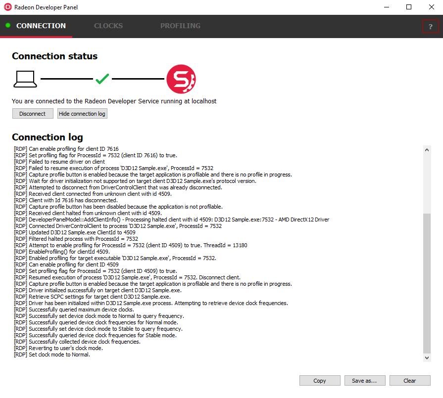
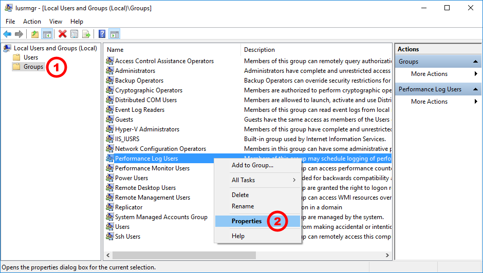

The Radeon Developer Panel
==========================

The Radeon Developer panel is part of a suite of tools that can be used
by developers to optimize DirectX12 and Vulkan applications for AMD GCN
graphics hardware. The suite is comprised of the following software:

-  **Radeon Developer Mode Driver** – This is shipped as part of the AMD
   public driver and supports the developer mode features
   required for profiling and debugging.

-  **Radeon Developer Service (RDS)** – A system tray application that
   unlocks the Developer Mode Driver features and supports
   communications with high level tools.

-  **Radeon Developer Service - CLI (Headless RDS)** – A console (i.e.
   non-GUI) application that unlocks the Developer Mode Driver features
   and supports communication with high level tools.

-  **Radeon Developer Panel (RDP)** – A GUI application that allows the
   developer to configure driver settings and generate profiles from
   DirectX12 and Vulkan applications.

-  **Radeon GPU Profiler (RGP)** – A GUI tool used to visualize and
   analyze the profile data.

   This document describes how the Radeon Developer Panel can be used to
   profile frame-based applications on AMD GCN graphics hardware. The
   Radeon Developer Panel connects to the Radeon Developer Service in
   order to collect a profile.

How to profile your application
===============================

Profiling on a local system
---------------------------

**IMPORTANT:** The application you want to profile must NOT already be
running. The panel needs to be configured in advance of starting your
application.

1) **Start the RadeonDeveloperPanel.exe** on your local system. The
   panel will startup up with the Connection tab already highlighted
   (see below).

..

   The UI has three main elements:

-  **Connection status** – to the Radeon Developer Service (currently
   not connected)

-  **Recent connections** – list shows a history of your previous
   connections

-  **New connection** – section that allows you to make either a new
   local or remote connection

1) **Connect the Radeon Developer Panel to the Radeon Developer
   Service** using either of the following methods:

   a. **Select the localhost entry in the “Recent connections” list,
      then click the “Connect” button.** This will start the Radeon
      Developer Service on the local system and establish a connection.

   b. **Double-click on any Recent connection**, and RDP will attempt to
      establish a connection to RDS running on the given host.

Note that the red dot to left of the “CONNECTION” tab should change to
green to indicate that the connection was successful.

    You may get a **“Failed to connect to RDS”** pop up message when
    running the panel for the very first time. If the Radeon Developer
    Service is not running, the panel will try to start the service
    automatically for local connections and this can fail due to Windows
    file permissions (the Radeon Developer Service will not be a known
    application to Windows and the program will not be permitted to
    start). If you see this message try manually starting the
    “RadeonDeveloperService.exe” and connect again.

1) **Select the executable you want to profile** using either of the
   following methods:

   a. Use the “…” button to browse to the executable, or manually type
      it in the executable name textbox.

   b. Select an active process within the Active Applications table, and
      click the “Add to targets” button. The process will need to be
      restarted in order to apply settings at application startup, and
      to enable collection of RGP profiles.

2) Click the “Add to list” button to add the new executable to the list
   of processes that will start in Developer Mode.

3) The “Enable profiling” check box should be checked automatically for
   the application you just added to the list.

4) **Start your application.**

   The driver will render an overlay on top of the application’s render
   window if all is working correctly. The overlay will indicate if
   Profiling is enabled for the application, and will display the Client
   Id that RDP uses to communicate with the process.

The panel will detect when your application has started, and will switch
to the Profiling tab.

.. image:: media/Profiling_1.png
  :width: 6.80562in
  :height: 5.84708in

1) **Click the “Capture profile” button** or press the **Ctrl + Shift +
   C** hotkey to generate an RGP profile. The hotkey can be useful when
   capturing profiles from applications running full screen or when an
   app requires focus when rendering. After a few seconds a new profile
   should appear in the list below.

   **Note:** Certain anti-virus software may block the hotkey feature
   from monitoring key presses.

   **Note to Linux users:** The hotkey is only available when starting
   the panel with root privileges (ie sudo ./RadeonDeveloperPanel). Root
   privileges are needed in order to read the keyboard device, which by
   default is found in the path ‘/dev/input/by-path’, and is a file
   ending with ‘event-kbd’. If this path doesn’t exist or the keyboard
   device has a different name, copy the KeyboardDevice.txt file from
   the docs directory to the root folder where these tools are located
   and edit this file so it contains the full path and file name of the
   keyboard device on your system.

.. media/Profiling_2.png
  :width: 6.84228in
  :height: 5.87858in

1) Right-clicking on a row in the list of recent profiles will open a
   context menu for the selected file. The context menu allows you to
   quickly navigate to the profile location in the filesystem, and
   rename or delete the file.

2) To open a profile file in the Radeon GPU Profiler, select the profile
   in the list and **click the “Open profile” button** or **double-click
   the selected row**.

Profiling on a remote system
----------------------------

There are two variations of the Radeon Developer Service: The GUI based
RadeonDeveloperService and the RadeonDeveloperServiceCLI (command line
interface). For headless operating systems which do not support a
graphical user interface, the RadeonDeveloperServiceCLI executable can
be started from a terminal console window.

The following steps are used to connect the RadeoDeveloperPanel to a
remote Radeon Developer Service:

1) **Start the RadeonDeveloperService or RadeonDeveloperServiceCLI
   executable** on the **remote** system.

   a. **NOTE: RadeonDeveloperServiceCLI** is a command line version of
      the Radeon Developer Service that has no UI components and is
      designed to run from the command line. Please note that no system
      tray icon will appear when the command line version of the service
      is running.

2) **Start the RadeonDeveloperPanel executable** on your **local**
   system. The panel will start up with the Connection tab already
   highlighted (see below).

3) In the **New connection** section, fill in the **Address** text box
   with the IP address of the remote system running the Radeon Developer
   Service.

4) **Click the “Connect new” button**. This will establish a connection
   to the remote system. The red dot to left of the “CONNECTION” tab
   should change to green to indicate that the connection was
   successful.

5) **Go to step 3** in **“**\ Profiling on a local system” above and
   continue.

How to use the Driver Settings
==============================

**NOTE:** Currently, the driver settings are only implemented for
DirectX12. Vulkan driver settings will be available soon.

The Radeon developer Panel (RDP) allows the developer to modify driver
settings to experiment with features that may affect performance and
quality. When you run RDP for the first time the driver settings are
empty in the tool and you will need to run your application with the
panel once to retrieve the driver settings. This is a one-time setup
process.

**The important thing to remember is that when you change settings they
will only be applied the next time you start the application. Changes to
the settings do not effect a currently running application.**

1) To get started with settings **configure your connection, connect,
   and setup your application** as shown below.

2) **Start your application** and let it run for a short while (few
   seconds) then terminate the process. This will populate the driver
   settings in the tool.

3) **Click on the Settings tab**

4) Currently, there are two categories of settings (Debug and General),
   and there are only 4 settings in total. Many more will be made
   available soon. The General settings are shown below. Click on the
   small arrow to the right of the setting name to see the possible
   values and descriptions. The “Default All” button will reset the
   values back to the original driver settings. Settings can also be
   exported and imported.

1) Make the changes you require to the settings and then click on the
   Connection tab.

2) Make sure you have selected the “Apply settings” checkbox on the
   application you wish to change the settings for.

3) Start your application, the settings are applied by the panel as your
   application starts.

4) Profile your application as described in the “\ **How to profile your
   application**\ ” section above.

Using the Clock settings
========================

The Radeon developer Panel (RDP) allows the developer to select from a
number of clock modes.

Normal clock mode will run the GPU as it would normally run your
application. To ensure that the GPU runs within its designed power and
temperature envelopes, it dynamically adjusts the internal clock frequency.
This means that profiles taken of the same application may differ
significantly, making side-by-side comparisons impossible.

Stable clock mode will run the GPU at a lower, fixed clock rate. Even though
the application may run slower than normal, it will be much easier to compare
profiles of the same application.

For the Radeon GPU Profiler tool, the clock settings here are not used since the
driver forces a profile to take place using peak clocks.

The Log
=======

Select the Log tab to see any logging information that is produced by
the driver and the panel activity. The driver can output logging
information about issues it has detected, and additional information
about the connection and any errors encountered by RDP and the RDS are
displayed here. Below is an example of typical output from a session
that captured two profiles. The log can be saved and cleared using the
buttons at the bottom.

| This log is also saved in a log file located at:
| "C:\\Users\\your\_name\\AppData\\Roaming\\RadeonDeveloperDriver\\RDPLogFile.txt"

| On Linux, this log is located at:
| "~/.RadeonDeveloperDriver/RDPLogFile.txt"

The Radeon Developer Service
============================

Two version of the Radeon developer service are provided, one with a
configuration UI and system tray icon, and one designed for use with
headless GPU system where no UI can be supported.

Radeon Developer Service for desktop developer system
-----------------------------------------------------

RadeonDeveloperService(.exe) – Can be used for general use where the
system has a monitor and UI (e.g. desktop development machines). The
Radeon Developer Service includes a configuration window containing
basic service configuration settings and software info. **Double click
the Radeon Developer Service system tray icon** to open the
configuration window, or right-click on the system tray icon and select
‘configure’ from the context menu.

.. image:: media/RDS_1.png
  :width: 3.55258in
  :height: 2.76080in

-  **Listen port** – The port that the Radeon Developer Service uses to
   listen for incoming connections from a remote Radeon Developer Panel.
   **The default port is 27300**. Altering the port will disconnect all
   existing sessions. The circular arrows icon to the right of the
   Listen port field can be clicked to reset the port to the default
   value.

-  **Version info** – Software version information for the Radeon
   Developer Service.

Double click the Radeon Developer Service system tray icon again or
right-click on the system tray icon and select ‘configure’ from the
context menu to close the configuration window.

**Please note** that when running both the Radeon Developer Panel and
the Radeon Developer Service on the same system the communication
between the two uses pipes, not sockets and ports, so setting the port
has no effect.

Radeon Developer Service for headless GPU systems
-------------------------------------------------

RadeonDeveloperServiceCLI(.exe) – Command line version for use with
headless GPU systems where no UI can be provided. NOTE: This version can
also run on a system that has a monitor and UI.

The following command line options are available for
RadeonDeveloperServiceCLI:

1) **-- port <port number>** *Overrides the default listener port used
   by the service (27300 is the default).*

2) **-- enableUWP** *Enables UWP support (disabled by default).*

**Please note** that the service will need to be explicitly started
before starting the Radeon Developer Panel. If the service isn’t
running, the Radeon Developer Panel will automatically start the UI
version of the Radeon Developer Service, which may not be what is
required.

Known Issues
============

Cleanup After a RadeonDeveloperServiceCLI Crash
-----------------------------------------------

If the RadeonDeveloperServiceCLI executable crashes on Linux, shared
memory may need to be cleaned up by running the RemoveSharedMemory.sh
script located in the script folder of the RGP release kit. Run the
script with elevated privileges using sudo.

Windows Firewall Blocking Incoming Connections
----------------------------------------------

1) **Deleting the settings file**. If problems arise with connection or
   application histories, these can be resolved by deleting the Radeon
   Developer Panel’s settings file at:
   "C:\\Users\\your\_name\\AppData\\Roaming\\RadeonDeveloperDriver\\RDPSettings.xml"

   on Windows. On Linux, the corresponding file is located at:

   "~/.RadeonDeveloperDriver/RDPSettings.xml"

2) **“Connection Failure”** error message. This issue is sometimes seen
   when running the panel for the very first time. The panel tries to
   start the service automatically for local connections and this can
   fail. If you see this message try manually starting the
   “RadeonDeveloperService.exe” and connect again.

3) **Remote connection attempts timing out.** When running the Radeon
   Developer Service on Windows, the Windows Firewall may attempt to
   block incoming connection attempts from other machines. The best
   methods of ensuring that remote connections are established correctly
   are:

   a. Allow the RDS firewall exception to be created within the Windows
      Firewall when RDS is first started. Within the Windows Security
      Alert popup, enable the checkboxes that apply for your network
      configuration, and click “Allow access”.

.. image:: media/Firewall_1.png
  :width: 5.48484in
  :height: 4.34000in

a. If “Cancel” was previously clicked in the above step during the first
   run, the exception for RDS can still be enabled by allowing it within
   the Windows Control Panel firewall settings. Navigate to the “Allow
   an app or feature” section, and ensure that the checkbox next to the
   RadeonDeveloperService.exe entry is checked:

.. image:: media/Firewall_2.png
  :width: 5.49000in
  :height: 3.72728in

.. image:: media/Firewall_3.png
  :width: 5.49000in
  :height: 3.72728in

a. Alternatively, disable the Windows Firewall entirely will also allow
   RDS to be connected to.

   **NOTE** The Windows firewall alert in no way indicates that the Radeon
   Developer tools are trying to communicate to an AMD server over the
   internet. The Radeon Developer tools do not attempt to connect to a remote
   AMD server of any description and do not send personal or system information
   over remote connections. The Radeon Developer Panel needs to communicate
   with the Radeon Developer Service, which may or may not be on the same
   machine, and a connection needs to be made between the two (normally via a
   socket).
 
Disabling Linux Firewall
------------------------

If the remote machine is running Linux and the **“Connection Failure”**
error message is displayed, the Linux firewall may need to be disabled.
This is done by typing “\ **sudo ufw disable**\ ” in a terminal. The
firewall can be re-enabled after capturing by typing “\ **sudo ufw
enable**\ ”.

Setting GPU clock modes on Linux
--------------------------------

Adjusting the GPU clock mode on Linux is accomplished by writing to
/sys/class/drm/card<n>/device/power\_dpm\_force\_performance\_level,
where <n> is the index of the card in question. By default this file is
only modifiable by root, so the application being profiled would have to
be run as root in order for it to modify the clock mode. It is possible
to modify the permissions for the file instead so that it can be written
by unprivileged users. The Radeon GPU Profiler package includes the
“\ **scripts/EnableSetClockMode.sh**\ ” script which will allow setting
GPU clock mode in cases where the target application is not, or cannot,
run as root. **Execute this script before running the Radeon Developer
Service and target application,** and the GPU clock mode can be updated
correctly at runtime.

Radeon Developer Panel connection issues on Linux
-------------------------------------------------

The Radeon Developer Panel may fail to start the Radeon Developer
Service when the Connect button is clicked. If this occurs, manually
start the Radeon Developer Service, select localhost from the the Recent
connections list and click the Connect button again.

Missing Timing Data for DirectX 12 Applications
-----------------------------------------------

To collect complete profile datasets for DirectX 12 applications, the
user account in Windows needs to be associated with the “Performance Log
Users” group. If these privileges aren't configured properly, profiles
collected under the user’s account may not include all timing data for
GPU Sync objects.

A batch file is provided to add the current user to the group
(scripts\\AddUserToGroup.bat). The batch file should be run as
administrator (Right click on file and select “Run as Administrator”).
The script’s output is shown below:

.. image:: media/Bat_1.png
  :width: 7.99000in
  :height: 2.66000in

Alternatively, to manually add the active user to the proper group,
follow these steps:

1) **Open the Run dialog** by using the Windows Start menu, or through
   the Windows + R shortcut.

   a. **Type** "**lusrmgr.msc**" into the Run window, and **click OK**.

.. image:: media/Run_1.png
  :width: 4.15000in
  :height: 2.14000in

2) Within the "Local Users and Groups" configuration window that opens,
   **select the Groups node**.

   a. **Select the Performance Log Users entry. Right-click and select
      Properties**.

1) To add the active user to the group, **click the Add... button**. (If
   the active user appears within this list, the account is already
   configured properly.)

.. image:: media/Add_User_1.png
  :width: 4.87912in
  :height: 5.55000in

2) **Type the active user's account name** into the Select Users,
   Computers, Service Accounts, or Groups dialog, and **click OK**.

.. image:: media/Select_User_1.png
  :width: 4.87912in
  :height: 2.68458in

3) When the user has been added to the group, **restart the machine**
   and log back in. RDS should now be configured to collect full timing
   information for DirectX 12 applications.

Radeon Developer Service Port numbers
-------------------------------------

Please note that when running both the Radeon Developer Panel and the
Radeon Developer Service on the same system the communication between
the two uses pipes, not sockets and ports, so setting the port has no
effect. In this scenario, it is possible to set the service to listen on
a no-default port, leave the panel on the default port, and connection
will work fine. This is a UI bug.

Problems caused by the presence of non-AMD GPUs and non-AMD CPUs with integrated graphics
-----------------------------------------------------------------------------------------

The presence of non-AMD GPU's and CPU's on your system can cause the failure to generate a profile
or apps to not run at all.

These problems typically occur with Vulkan apps in systems that have:

1) A non-AMD CPU with in integrated non-AMD GPU

2) A non-AMD discrete GPU

Vulkan applications, by default, use GPU 0 which usually maps to the integrated GPU, or in some cases,
the non-AMD discreete GPU. In both cases Vulkan apps will either fail to run, or RGP profiling will not work
(no RGP overlay will be present in these cases).

To avoid these issues:

1) Disable any non-AMD integrated GPU's in the device manager
2) Disable any non-AMD discrete GPU's in the device manager, and/or physically remove from the system.

